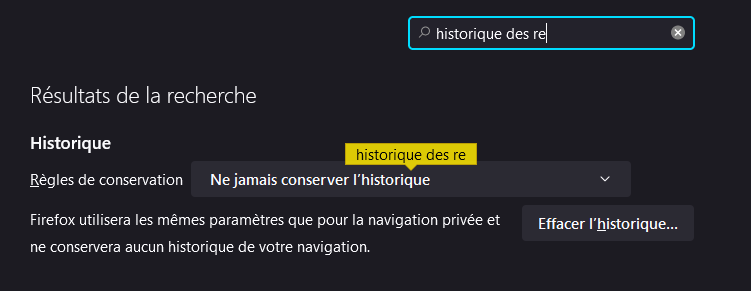
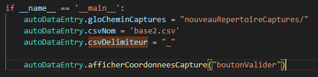
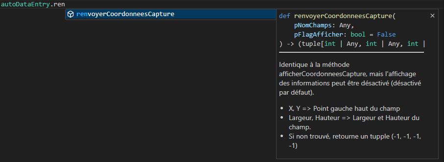

## Introduction:
autoDataEntry est un module Python que j'ai écrit afin de réaliser de la saisie automatique de données au sein d'autres applications.
Il permet de réaliser différentes actions, comme par exemple:
- D'entrer du texte dans un champ de saisie 
- De cliquer avec la souris sur un radio bouton pour valider des options, ou sur un bouton pour valider une saisie
- D'effectuer un scroll de souris
- De détecter un potentiel message d'erreur et d'agir en conséquence
- D'attendre le chargement d'un formulaire
- Charger un fichier CSV de données à envoyer à un programme tiers
- ...

autoDataEntry est capable de repérer des zones précises dans un programme et d'interagir avec elles. Pour ce faire, l'utilisateur va pouvoir lui passer des captures d'écran de ces fameuses zones.

## But:
Gagner du temps lors de la saisie de données répétitives dans des applications.
En effet, la saisie de centaines voire de milliers de données dans des programmes, peut représenter parfois plusieurs semaines de travail pour une secrétaire. Ce programme permet de réaliser cette saisie automatiquement.

autoDataEntry fonctionne aussi bien avec une application classique (client lourd) qu'avec un site internet. Toutefois, dans le cas d'un site internet, un programme à base de Web scraping serait plus rapide.

## Librairies utilisées
autoDataEntry utilise les librairies suivantes:

- pyautogui
- time
- csv
- pyperclip
- re

## Installation:
- Installer Python
- Importer le projet soit avec les commandes git, soit en téléchargeant les fichiers avec l’interface de github
- Ouvrir le répertoire téléchargé et tester votre installation de python en ouvrant une fenêtre de commande, puis en entrant la commande suivante : (`py --version`). Normalement votre version de python doit apparaître
- Installer pyautogui: `pip intall pyautogui`
- Installer pyperclip: `pip install pyperclip`
- Mettre à jour Pillow (en cas de problème): `pip install --upgrade Pillow`
- Conseil numéro 1: Installer un éditeur de code (par exemple VsCode) 
- Conseil numéro 2: Pensez à activer le support du langage Python dans les extensions de Vscode. Cela vous permettra de sélectionner plus facilement les méthodes que vous utiliserez pour configurer votre propre outil de pilotage d'applications    

- Conseil numéro 3: Si vous comptez utiliser ce programme pour réaliser de la saisie de grandes quantités de données sur un site Web, il peut être utile (dans certains cas), de désactiver au préalable l'historique de recherche


## Utilisation:
Pour utiliser autaDataEntry:
- Ouvrez le programme à piloter (Il doit être visible sur l'écran)
- Lancez le .bat **autoDataEntry.bat** 
- Placez **autoDataEntry.bat**  en dehors de la fenêtre du programme à piloter (par exemple sur un deuxième écran) 
- Appuyez sur n'importe qu'elle touche. Le traitement va se lancer, avec les actions que vous aurez demandées (voir la partie: **Configuration**)

**Note:** 
Pour fonctionner correctement, le .bat autoDataEntry.bat doit se trouver en dehors de la zone utilisée par le programme à piloter. En effet, s'il recouvre une partie d'un formulaire à piloter, les méthodes de recherche ne pourront pas trouver ce formulaire.  

Si vous préférez lancer autoDataEntry en ligne de commande:
- Ouvrez une fenêtre de commande dans le répertoire d'installation de autoDataEntry
- Lancez la commande suivante:
```
py main.py
```

## Configuration:

Toutes les configurations et les lignes de traitement (voir plus bas) sont à faire dans le fichier **main.py** directement en-dessous de la ligne suivante:
`if __name__ == '__main__':`

Exemple:  


### Configuration du répertoire des captures:
Pour fonctionner correctement, autoDataEntry aura besoin d'accéder aux captures d'écran représentant des portions de l'interface graphique, du programme avec lequel il devra interagir. Par exemple un champ de saisie dans lequel il doit entrer du texte, ou une case à cocher sur laquelle il doit cliquer.

Par défaut, autoDataEntry est configuré pour aller chercher les images sous le répertoire:  
*assets/images/captures/*  
Vous pouvez modifier ce chemin en modifiant le paramètre optionnel:  
*autoDataEntry.gloCheminCaptures*

Exemple:  
`autoDataEntry.gloCheminCaptures = "nouveauRépertoireCaptures/"`

Des exemples de captures d'écran se trouvent sous:  
*zonesARechercher\exemples*

Ces captures d'exemples avaient été utilisées pour mes propres besoins.

### Configuration du répertoire du fichier CSV de base de données:
Pour la saisie d'une grande quantité de données dans un programme, autoDataEntry peut importer les données depuis un fichier CSV.  
Il est également capable d'ajouter une colonne de donnée à la fin de chaque ligne, en précisant si la donnée a pu être importée ou nom. Ceci est très pratique! En effet, cela permet de corriger les éventuelles erreurs et de relancer le traitement des données, sans risque de réimporter dans le programme à piloter, plusieurs fois le même jeu de données.

Par défaut, autoDataEntry va rechercher un fichier csv appelé base.csv, dans le répertoire d'installation.   
- Vous pouvez modifier ce chemin en modifiant le paramètre optionnel:  
*autoDataEntry.csvNom*  
- Vous pouvez également modifier le délimiteur par défaut du fichier CSV. Le délimiteur est le caractère qui identifie la fin de chaque colonne d'un fichier CSV. Par défaut, autoDataEntry utilise le caractère: `;`
*autoDataEntry.csvDelimiteur*  

|Délimiteur `;`|Délimiteur ` `|
|-|-|
|nom;prenom;adresse|nom prenom adresse|

Exemple:  
`autoDataEntry.csvNom = "nouveauNom.csv"`  
`autoDataEntry.csvDelimiteur = " "`

### Méthodes de base autoDataEntry:
autoDataEntry dispose de différentes fonctionnalités/méthodes, décrites ci-dessous.

Pour obtenir de l'aide sur les différentes méthodes utilisables, entrer simplement `autoDataEntry.`  
Un menu d'aide décrivant les différentes méthodes doit apparaître. 

(Ce menu nécessite l'installation du *support du langage Python* => Voir le chapitre **Installation**)

#### afficherCoordonneesCapture:
Affiche et renvoie les coordonnées et dimensions d'un champ.  
- X, Y             => coordonnées gauche haut du champ  
- Largeur, Hauteur => Largeur et Hauteur du champ.
- Si non trouvé, retourne un tupple (-1, -1, -1, -1)

Exemple:  
`autoDataEntry.afficherCoordonneesCapture("boutonValider")`

#### renvoyerCoordonneesCapture:
Identique à la méthode afficherCoordonneesCapture, mais l'affichage des informations peut être désactivé (désactivé par défaut).  
- X, Y             => Point gauche haut du champ
- Largeur, Hauteur => Largeur et Hauteur du champ.  
- Si non trouvé, retourne un tupple (-1, -1, -1, -1)


Exemple:  
`autoDataEntry.afficherCoordonneesCapture("boutonValider", true)`

#### attendreApparition:
Attend que le programme à piloter affiche une information (popup, nouveau menu, nouveau formulaire, nouvelle fenêtre...)  
Parfois certaines fonctionnalités mettent du temps à apparaître ou apparaissent progressivement.  
Cette méthode recherche en boucle sur le site la capture passée en paramètre.  
- pCapture               => Image à rechercher sur le site
- pNbreTentative         => (Optionnel) Nombre de tentative de recherche
- pTempsEntreTentative   => (Optionnel) Temps entre chaque tentative
- pFlagAffiMessErr       => (Optionnel) Affiche un message à chaque tentative échouée
- pFlagAffiMessTrouve    => (Optionnel) Affiche un message si capture trouvée
- flagArreterSiNonTrouve => (Optionnel) Arrête le script python si la capture n'est pas trouvée

#### verifierPasApparition:
Vérifie que le programme à piloter n'affiche PAS une alerte (message d'erreur, fenêtre indésirable, messageBox compromettant...)  
- Parfois certaines alertes mettent du temps à apparaître ou apparaissent progressivement.  
- Cette fonction recherche en boucle sur le site que la capture passée en paramètre n'apparaît PAS!  
- pCapture                => Image à rechercher sur le site
- pNbreEssaisAEff         => (Optionnel) Nombre d'essais à effectuer
- pTempsEntreEssais       => (Optionnel) Temps entre chaque essai
- pFlagAffiMessNonTrouve  => (Optionnel) Affiche un message à chaque essais réussi (capture non trouvée!)
- pFlagAffiMessTrouve     => (Optionnel) Affiche un message d'avertissement si capture trouvée
- flagArreterSiTrouve     => (Optionnel) Arrête le script python si la capture est trouvée

#### mettreEnPause:
Met en pause le programme pendant la durée spécifiée en secondes.  
Si aucune durée n'est spécifiée, la pause dure 1/2 seconde.

#### cliquerSur:
Recherche un champ (passé en paramètre sous forme d'une capture PNG) et clique dedans.  
- positionClic           => Par défaut le clic se fait au centre du champ trouvé.  
                              Valeurs possibles (centré, gauche, droite)  
- offsetX                => Décalage en pixel (positif ou négatif) par rapport à la positionClic  
- flagArreterSiNonTrouve => A True (valeur par défaut), arrête le programme si le champ n'est pas localisé. A False, le programme continue

#### cliquerSurSexe:
 Permet de détecter puis de cliquer sur l'un des deux boutons radio SEXE fourni en exemple (voir le répertoire captureExemples des assets).  
  

- M => Demande de cliquer sur le sexe masculin
- F => Demande de cliquer sur le sexe féminin
- decalageEnX => Nombre de pixel de décalage vers la gauche entre la zone trouvée (le dessin) et l'endroit où doit avoir lieu la capture (le bouton radio) 

Cette méthode est en fait destinée à cliquer sur un type de bouton radio bien précis (voir le répertoire captureExemples des assets). Si les radio boutons ne sont pas exactement les mêmes (probables), le décalage est les captures d'écran devront bien sûr être adaptés. 

#### scrollSouris:
Permet de simuler la molette de la souris pour monter ou descendre l'ascenseur du navigateur.
- Un nombre positif de pixel monte l'ascenseur.
- Un nombre négatif le fait descendre. Par défaut -500 pixels.

#### ecrire:
Écrit un texte passé en paramètre à l'endroit où la souris vient de cliquer, après appel de la fonction: `cliquerSur`

### Méthodes avancées de base autoDataEntry:
Les méthodes avancées de autoDataEntry permettent la gestion du fichier base.csv.
Celui-ci doit avoir la structure suivante:   
```donnée1;donnée2;donnée3...;donnéeX;NON```

Un fichier d'exemple est disponible dans le répertoire d'installation de autoDataEntry.

#### lireCsv:
Lit ligne par ligne le fichier CSV fourni et lance, pour chaque ligne, une suite d'opération définie dans la méthode: `effectuerTraitement`.

Rappel: Pour modifier le nom et le chemin du fichier CSV, voir la section: **Configuration du répertoire du fichier CSV de base de données**.

Pour chaque ligne traitée du fichier CSV, en plus d'appeler `effectuerTraitement`, `lireCsv` va également appeler la méthode `majCsv`, qui va modifier la dernière colonne en indiquant si les instructions ont été correctement effectuées  dans le programme à piloter (OUI). 

#### majCsv:
Passe les lignes traitées du fichier CSV à OUI (modification de la dernière colonne).  
Cette méthode est appelée automatiquement par lireCsv et ne devrait normalement pas être appelée par l'utilisateur.

#### effectuerTraitement:
Contrairement aux autres méthodes, cette méthode se trouve dans le fichier **main.py**, car elle doit être modifiée par l'utilisateur!  

Elle est utile dans le cas où on utilise un fichier CSV de base de données.   
Pour chaque ligne du fichier CSV, cette méthode sera appelée automatiquement par la méthode lireCsv afin d'effectuer une suite d'opérations.  

L'utilisateur doit donc y entrer les différentes opérations à réaliser pour chaque ligne du fichier CSV.  

Pour accéder aux colonnes de la ligne courante du fichier CSV, il faut entrer le mot clé `base`.

Exemple:  
- base[0] => Première colonne du fichier CSV
- base[1] => deuxième colonne du fichier CSV
- base[10] =>onzième colonne du fichier CSV

### Problèmes connus:
- Il arrive avec certaines applications à piloter, que leurs formulaires ne soient utilisables qu'une fois que l'application a le focus.   
=> *Dans ce cas, une solution consiste à demander au préalable à autoDataEntry de cliquer à un endroit précis de l'application à piloter (par exemple l'entête de la fenêtre).*

